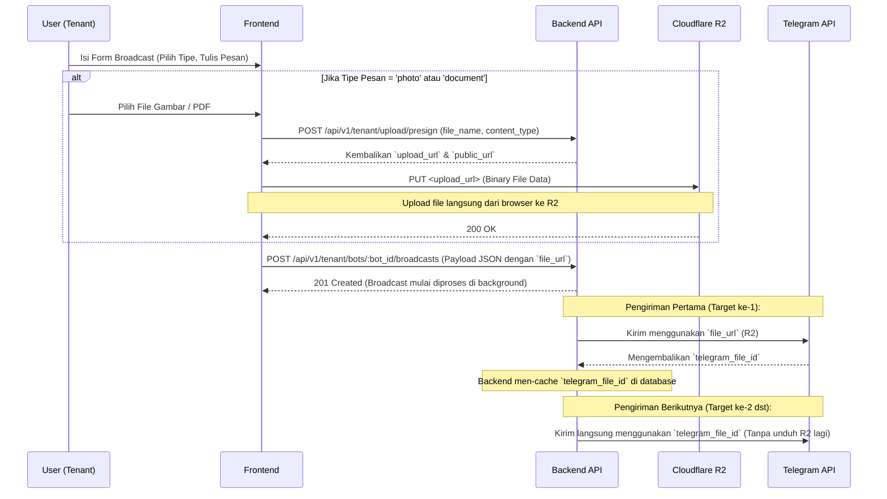

# Panduan Integrasi Frontend: Fitur Broadcast Telegram

Dokumen ini berisi panduan teknis, alur integrasi (flow), serta spesifikasi API untuk tim Frontend dalam mengimplementasikan antarmuka fitur **Broadcast Telegram** pada dashboard tenant.

Fitur ini memungkinkan tenant untuk mengirim pesan massal ke seluruh grup aktif, atau ke seluruh member DM secara asinkron. Fitur ini mendukung pengiriman **Teks**, **Foto (Gambar)**, dan **Dokumen (PDF/File)**.

---

## 1. Alur Kerja (Workflow) & Integrasi Media

Proses pengiriman pesan yang memiliki media (foto/dokumen) menggunakan alur direct-upload ke Cloudflare R2 via Presigned URL untuk performa optimal, serta sistem **Telegram File ID caching** otomatis di backend agar menghemat bandwidth R2.



---

## 2. API Endpoints

Semua endpoint di bawah ini membutuhkan header `Authorization: Bearer <token_jwt>`.

### A. Mendapatkan S3 Presigned URL (Jika Ada Lampiran)

Gunakan endpoint ini untuk meminta URL upload khusus (_presigned URL_) sebelum mengunggah file.

- **URL:** `POST /api/v1/tenant/upload/presign`
- **Request Body:**

```json
{
  "file_name": "poster-promo.jpg",
  "content_type": "image/jpeg"
  // Gunakan "application/pdf" untuk dokumen
}
```

- **Response (200 OK):**

```json
{
  "message": "Presigned URL berhasil dibuat",
  "data": {
    "upload_url": "https://<bucket>.r2.cloudflarestorage.com/tenant_uploads/...",
    "public_url": "https://pub-<id>.r2.dev/tenant_uploads/...",
    "expires_at": "2026-06-28T14:30:00Z"
  }
}
```

### B. Mengunggah File ke R2

Lakukan request HTTP `PUT` ke `upload_url` yang didapatkan dari langkah sebelumnya. **Penting:** Jangan tambahkan header `Authorization` API internal ke request ini.

- **Method:** `PUT`
- **URL:** `<upload_url>`
- **Headers:** `Content-Type: <content_type>`
- **Body:** Binary File Data (dari `<input type="file" />`)

```javascript
// Contoh menggunakan fetch
await fetch(upload_url, {
  method: "PUT",
  headers: {
    "Content-Type": file.type, // Harus sama dengan yang dikirim ke API presign
  },
  body: file,
});
```

### C. Membuat Broadcast Baru

Setelah file diunggah (jika ada), kirimkan data form beserta `public_url` file ke backend.

- **URL:** `POST /api/v1/tenant/bots/:bot_id/broadcasts`
  _(Ganti `:bot_id` pada path URL dengan UUID bot yang sedang dipilih)_
- **Request Body:**

```json
{
  "target_type": "group",
  // Pilihan: "group" (ke seluruh grup) atau "member" (ke seluruh chat DM member)

  "message_type": "photo",
  // Pilihan: "text", "photo", "document"

  "message_text": "<b>Promo Spesial!</b>\n\nDapatkan diskon hingga 50% untuk langganan bulan ini.",
  // Mendukung format HTML untuk styling (<b>, <i>, <a>, <u>, <s>, <code>)

  "file_url": "https://pub-<id>.r2.dev/tenant_uploads/...",
  // Wajib diisi jika message_type = "photo" atau "document". Kosongkan jika "text".

  "scheduled_at": "2026-06-28T16:30:00Z"
  // Opsional. Kirim dalam format RFC3339 UTC jika ingin dijadwalkan di masa depan (min. 1 menit ke depan).
  // Kosongkan/abaikan jika ingin langsung dikirim (instan).
}
```

- **Response Sukses (201 Created):**

```json
{
  "message": "Broadcast berhasil dibuat dan mulai diproses",
  "data": {
    "id": "e8a9f62c-...",
    "bot_id": "...",
    "target_type": "group",
    "status": "scheduled", // Berstatus "scheduled" jika menggunakan jadwal, "pending" jika instan
    "total_targets": 0, // Bernilai 0 jika scheduled karena target di-query saat waktu eksekusi tiba
    "sent_count": 0,
    "failed_count": 0,
    "scheduled_at": "2026-06-28T16:30:00Z"
  }
}
```

- **Response Gagal Kuota Penuh (400 Bad Request):**

```json
{
  "message": "Kuota broadcast bulanan Anda sudah penuh (3/3). Silakan upgrade paket platform.",
  "error": "Bad Request"
}
```

### D. Mengambil Riwayat Broadcast

Digunakan untuk menampilkan daftar riwayat broadcast yang pernah dibuat oleh tenant.

- **URL:** `GET /api/v1/tenant/bots/:bot_id/broadcasts?page=1&limit=10`
- **Response (200 OK):**

```json
{
  "message": "Berhasil mengambil riwayat broadcast",
  "data": [
    {
      "id": "e8a9f62c-...",
      "target_type": "group",
      "message_type": "photo",
      "message_text": "<b>Promo Spesial!</b>...",
      "file_url": "https://...",
      "status": "completed",
      // status: "pending", "processing", "completed"
      "total_targets": 150,
      "sent_count": 148,
      "failed_count": 2,
      "created_at": "2026-06-28T14:30:00Z"
    }
  ],
  "meta": {
    "page": 1,
    "limit": 10,
    "total_data": 1,
    "total_pages": 1
  }
}
```

---

## 3. Catatan Penting untuk UI/UX Frontend

1. **Batasan Karakter Input Teks:**
   - Jika `message_type` = **text**: Maksimal **4096 karakter**.
   - Jika `message_type` = **photo** atau **document**: Maksimal **1024 karakter** (karena bertindak sebagai caption).
   - Tampilkan _character counter_ pada textarea untuk membimbing user.

2. **Dukungan Format HTML:**
   - Backend memproses teks dengan parser HTML. Frontend disarankan menyediakan editor teks kaya sederhana (Rich Text Editor) untuk membantu memformat teks dengan tag `<b>`, `<i>`, `<u>`, `<s>`, `<code>`, dan `<a href="...">`.

3. **Loading State & Double-Submit:**
   - Upload file langsung ke R2 membutuhkan waktu. Tampilkan progress bar atau loading spinner saat mengunggah file dan menonaktifkan tombol "Kirim" selama proses berlangsung demi menghindari submit ganda.

4. **Handling Batasan Kuota (HTTP 400):**
   - Jika respons API mengembalikan status 400 dengan pesan yang menunjukkan kuota penuh, tampilkan popup/modal berisi ajakan untuk meng-upgrade paket platform tenant.

5. **Auto-Refresh Status (Polling):**
   - Karena pengiriman pesan berjalan secara asinkron melalui RabbitMQ antrean background, status pengiriman di tabel riwayat mungkin masih berstatus `pending` atau `processing`.
   - Lakukan polling (misalnya setiap 10-15 detik) untuk mendeteksi perubahan status dan memperbarui kolom `sent_count` dan `failed_count` secara real-time.
